# product-update-digest

A daily cron job that scrapes news and blog posts from Cribl and Ocient (blog posts, press releases, product page changes), summarizes them with an LLM via [OpenRouter](https://openrouter.ai), publishes a static feed to GitHub Pages, and stores embeddings in a [sqlite-vec](https://github.com/asg017/sqlite-vec) vector database for retrieval by an AI assistant or the `tools/search.py` CLI.

## What it does

1. **Scrapes** Cribl and Ocient websites for new or changed content
2. **Deduplicates** using SQLite — skips unchanged content via URL tracking and SHA-256 content hashing
3. **Summarizes** each new item using a configurable LLM (default: `google/gemma-3-27b-it` via OpenRouter)
4. **Stores** summaries and vector embeddings in sqlite-vec for semantic search (default: `qwen/qwen3-embedding-8b` via OpenRouter)
5. **Publishes** a static HTML digest to GitHub Pages

## Requirements

- Python 3.13
- [uv](https://docs.astral.sh/uv/) — fast Python package manager
- [OpenRouter](https://openrouter.ai) API key
- GitHub personal access token with `repo` scope (for pushing to GitHub Pages)

## Setup

```bash
# install uv (once per machine)
curl -LsSf https://astral.sh/uv/install.sh | sh

git clone https://github.com/<you>/product-update-digest.git
cd product-update-digest
make sync
cp .env.example .env
# edit .env with your API keys and config
```

`make sync` runs `uv sync --extra dev`, which creates the venv and installs all dependencies. No separate services required.

## Configuration

All configuration is via environment variables (`.env` file locally, system env in production):

| Variable | Description |
|---|---|
| `OPENROUTER_API_KEY` | OpenRouter API key |
| `OPENROUTER_SUMMARIZATION_MODEL` | LLM for summaries (default: `google/gemma-3-27b-it`) |
| `OPENROUTER_STAGE_SUMMARIZATION_MODEL` | LLM for `--stage summarize` (defaults to `OPENROUTER_SUMMARIZATION_MODEL`) |
| `OPENROUTER_EMBEDDING_MODEL` | Embedding model (default: `qwen/qwen3-embedding-8b`) |
| `EMBEDDING_DIMENSIONS` | Vector dimensions matching the embedding model (default: `4096`) |
| `SQLITE_DB_PATH` | Path to SQLite database (default: `data/product_updates.db`) |
| `GITHUB_TOKEN` | GitHub PAT for pushing to gh-pages |
| `GITHUB_REPO` | Target GitHub repo for Pages (e.g., `username/product-updates`) |
| `GITHUB_PAGES_BRANCH` | Branch to publish to (default: `gh-pages`) |
| `MAX_ARTICLE_AGE_DAYS` | How far back to index articles (default: `30`) |
| `MAX_API_RETRIES` | Max retry attempts for LLM/embedding API calls (default: `5`) |
| `OLLAMA_BASE_URL` | Local Ollama server URL (e.g. `http://localhost:11434/v1`); when set, takes precedence over OpenRouter for summarization |
| `OLLAMA_SUMMARIZATION_MODEL` | Ollama model for full-pipeline summarization (e.g. `gemma3:4b`) |
| `OLLAMA_STAGE_SUMMARIZATION_MODEL` | Ollama model for `--stage summarize`; defaults to `OLLAMA_SUMMARIZATION_MODEL` |

### Model recommendations
As of 2026-05-30, evaluated by Claude Sonnet 4.6.

**Summarization** (`OPENROUTER_SUMMARIZATION_MODEL` / `OPENROUTER_STAGE_SUMMARIZATION_MODEL`):

| Model | Input | Output | Notes |
|---|---|---|---|
| `google/gemma-4-26b-a4b-it:free` | free | free | Rate-limited; good for `--stage summarize` testing |
| `google/gemma-3-12b-it` | $0.04/M | $0.13/M | Budget pick; solid quality |
| `google/gemma-3-27b-it` | $0.08/M | $0.16/M | **Best bang-for-buck; default** |
| `deepseek/deepseek-v4-flash` | $0.10/M | $0.20/M | Fast; 1M context window |
| `deepseek/deepseek-v3.2` | $0.25/M | $0.38/M | Higher quality step-up |
| `anthropic/claude-haiku-4-5` | ~$1/M | ~$5/M | Reference point; 6–30× pricier than Gemma |

**Expected cost with `google/gemma-3-27b-it`:** a typical article (2,000 token input, 300 token output) costs roughly $0.0002. At 5 new articles per day that's ~$0.001/day or **under $0.04/month**. A full corpus re-summarization of 300 articles costs about $0.06 total.

**Embeddings** (`OPENROUTER_EMBEDDING_MODEL` / `EMBEDDING_DIMENSIONS`):

| Model | Price | Dimensions | Notes |
|---|---|---|---|
| `qwen/qwen3-embedding-8b` | $0.01/M | 4096 | **#1 MTEB multilingual leaderboard; default** |
| `openai/text-embedding-3-small` | $0.02/M | 1536 | Well-tested; former default |
| `openai/text-embedding-3-large` | $0.13/M | 3072 | OpenAI's best; diminishing returns here |

**Expected cost with `qwen/qwen3-embedding-8b`:** embedding a corpus of 300 articles (~450K tokens total) costs less than $0.01. Ongoing daily cost rounds to zero.

> **Note:** switching embedding models requires re-embedding your entire vector store since vector dimensions must be consistent. Drop the `vec_items` and `vec_embeddings` tables and re-run the full pipeline.

## Usage

```bash
uv run digest                   # full pipeline: scrape → summarize → vector → publish
uv run digest --site cribl      # run only the Cribl scraper (default: both)
uv run digest --publish         # rebuild full site from DB and push to GitHub Pages
```

All stage commands write preview HTML to `data/dry-run/` for local review before publishing.

### Pipeline stages (for development / testing)

Run one stage at a time with `--stage <name>`:

| Stage | Command | What it does |
|---|---|---|
| scrape | `uv run digest --stage scrape` | Fetches pages, caches text in SQLite, writes `data/dry-run/` scrape preview |
| summarize | `uv run digest --stage summarize` | Calls LLM on cached articles, writes summary preview to `data/dry-run/` |
| vector | `uv run digest --stage vector` | Embeds cached articles into a temp store (`data/dry-run/vec_test.db`), writes full-text listing preview |
| render | `uv run digest --stage render` | Renders the full site from the DB to `data/dry-run/` for local review |

The `scrape`, `summarize`, and `vector` stages write **preview** HTML to `data/dry-run/` showing only the articles processed in that run — they are not suitable for publishing directly. Use `--stage render` to generate a full preview of the site as it would appear on GitHub Pages, then `--publish` to push it. `--stage render` is also useful as a recovery tool if the published pages ever get into a bad state.

`--stage summarize` uses `OPENROUTER_STAGE_SUMMARIZATION_MODEL` (falls back to `OPENROUTER_SUMMARIZATION_MODEL` if unset). Set it to a free-tier model (e.g. `google/gemma-4-26b-a4b-it:free`) to avoid charges during testing. Alternatively, set `OLLAMA_BASE_URL` to use a local model instead.

Use `--limit N` to control how many articles per company are processed. Defaults to 1 for `scrape` and `summarize`; all cached articles for `vector` and `render`.

Use `--category` to filter by article type — useful for checking whether summaries look right for each category:

| Value | Description |
|---|---|
| `blog` | Blog posts |
| `press_release` | Press releases |
| `product` | Product page changes |

```bash
uv run digest --stage scrape --limit 5 --site ocient
uv run digest --stage summarize --category press_release
uv run digest --stage summarize --category blog --site cribl
```

## Semantic search

```bash
uv run python tools/search.py                        # search production store
uv run python tools/search.py --company cribl
uv run python tools/search.py --results 10
uv run python tools/search.py --temp                 # search --stage vector dry-run store
uv run python tools/search.py --temp --company cribl
```

## Running tests

```bash
make test
```

82 tests, no external services required (SQLite uses in-memory DB; HTTP calls are mocked).

## Deployment

See [DEPLOYMENT.md](DEPLOYMENT.md) for full instructions covering GitHub Pages first-time initialization and cron job configuration.

## Architecture



```
main.py                        # orchestration entry point
config.py                      # pydantic-settings config
summarizer.py                  # LangChain summarization chain
scrapers/
  base.py                      # abstract scraper (dedup loop, retry logic)
  cribl.py                     # Cribl scraper (sitemap-based discovery)
  ocient.py                    # Ocient scraper (sitemap-based discovery)
storage/
  models.py                    # Pydantic models: ScrapedPage, ArticleRecord, ProductUpdate
  db.py                        # SQLite client (URL tracking, deduplication)
  vec_client.py                # sqlite-vec client (vector storage, semantic search)
publisher/
  github_pages.py              # Jinja2 HTML rendering + git push to gh-pages
  templates/
    index.html.j2              # top N updates across all companies (INDEX_PAGE_LIMIT)
    company_index.html.j2      # full history for one company, grouped by month
tools/
  search.py                    # CLI for semantic search over the vector store
docs/
  plan.md                      # implementation plan
```

**Storage split**: SQLite handles deduplication and operational metadata; sqlite-vec handles embeddings and semantic search. Both live in the same `.db` file and are cross-referenced via a `vec_id` field (MD5 of the normalized URL).

## Vector store schema

The `vec_items` table (and the `vec_embeddings` virtual table alongside it) stores the following, also used by the `tools/search.py` CLI and any external consumers:

| Field | Type | Notes |
|---|---|---|
| `id` | string | MD5 of normalized URL (`vec_id_for(url)`) |
| `url` | string | canonical article URL |
| `company` | string | `cribl` or `ocient` |
| `category` | string | `blog`, `press_release`, or `product` |
| `title` | string | article title |
| `scraped_at` | string | ISO 8601 |
| `published_date` | string | ISO 8601, nullable |
| `summary` | string | LLM-generated summary |
| `source_text` | string | truncated raw article text (what gets embedded) |

## Design Notes

Scrapers use the sitemap.xml files for URL discovery rather than scraping listing pages, which avoids JS-rendered pagination and gives reliable `lastmod` dates for pre-filtering old articles. All HTTP fetching uses httpx only — no headless browser needed.

Vector storage uses sqlite-vec (a ~163KB SQLite extension) instead of a separate Chroma server. This eliminates the need for a running HTTP service and reduces the venv from ~500MB to ~260MB by dropping onnxruntime, numpy, kubernetes, and grpcio.

Moving to uv dropped the .venv size to a mere 118 MB.

## License

MIT
